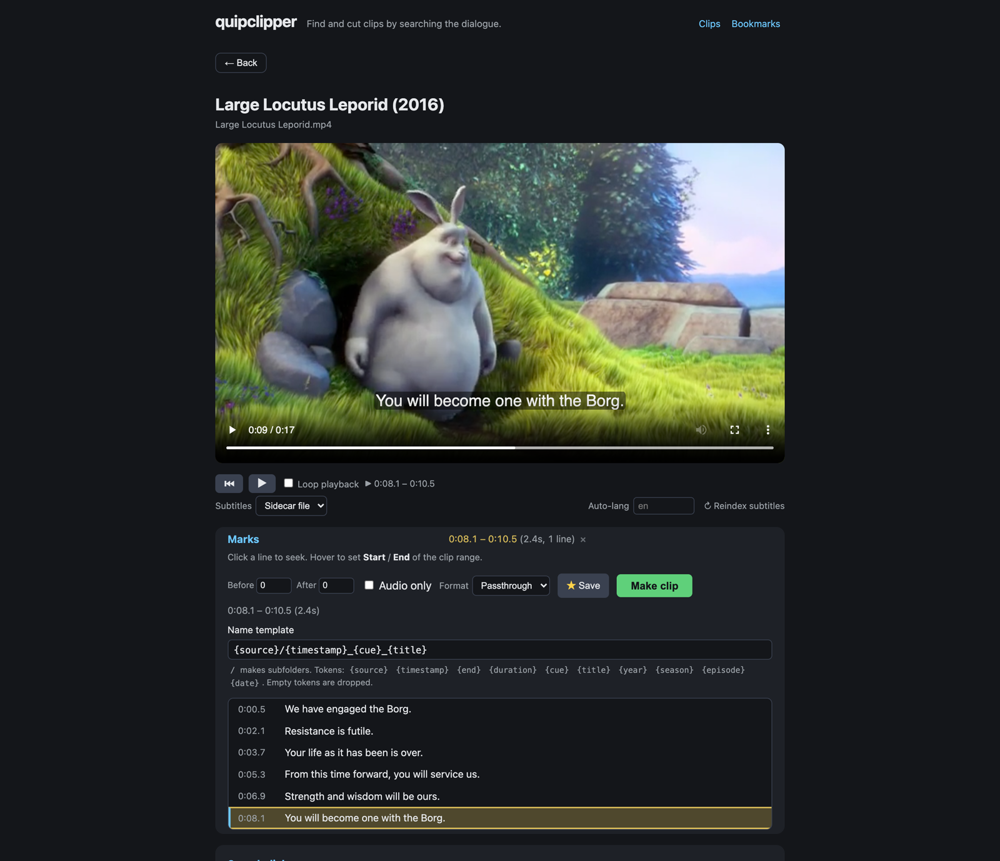

# quipclipper

Find and cut audio/video clips from your movie & TV library by **searching the
subtitle dialogue** — from any browser.

Subtitles already carry precise timestamps, so the whole trick is: parse the
subtitles → fuzzy-search the line you remember → map the match back to its time
span → cut it out with ffmpeg. quipclipper is a **self-hosted web app**: point it
at your media folders, browse to a video (or search dialogue across a whole
folder), type the line you remember, and cut a lossless clip — all in the
browser.

A **command-line tool** ([`quipclipper-cli`](#quipclipper-cli)) wraps the same
engine for scripting and quick one-off cuts.



> **Documentation:** [`docs/MANUAL.md`](docs/MANUAL.md) is the complete user
> manual; [`docs/DESIGN_NOTES.md`](docs/DESIGN_NOTES.md) explains the design
> decisions and their rationale.

## Features

- **Library browser** — browse multiple media folders (movies, shows, etc.) with
  a search bar to filter by name and a clickable breadcrumb for jumping up levels.
- **Dialogue search** — open a video and fuzzy-search its subtitles (sidecar or
  embedded), with surrounding context and ranked, typo-tolerant matches. Clicking
  a result selects the matching dialogue line in **Marks** (highlighted in the
  script), ready to clip or fine-tune.
- **Folder dialogue search** — search subtitles across every video in one or more
  folders at once (including the folders surfaced by a library search). Useful for
  finding a line when you don't know which episode it's in. Clicking a hit opens
  that file and selects the matched line in Marks. A subtitle cache plus a
  pre-index button make repeat searches near-instant.
- **Scrolling script view** — the full subtitle script scrolls with playback;
  click a line to seek, hover (or tap, on touch) for Start/End buttons to select
  a clip range by dialogue lines (timestamps are derived from the selected cues).
  A **Before/After buffer** in the Marks header expands the selection live.
- **Stream selector** — one menu under the seek bar picks the subtitle track,
  the audio stream, and (for multichannel audio) a channel subset — affecting
  live playback. The selection drives the clip output too: the chosen audio
  stream and channel subset, and the selected subtitle becomes the clip's
  default track.
- **Lossless clipping** — mkvmerge with automatic ffmpeg fallback, an async job
  queue, and a clips library. Audio export offers three lossless modes:
  **Passthrough** (stream-copy the original codec, all tracks), **WAV/FLAC**
  (full-mix re-encode keeping every channel — a 5.1 source becomes a 5.1 WAV/FLAC
  in one file), and **Split channels** (one file per channel group: stereo pairs
  + centre/LFE).
- **Bookmarks** — save selected dialogue ranges as named bookmarks per file
  (with their buffer + stream selection), browse them all from a top-level
  Bookmarks view, adjust each one's buffer inline, or Clear all.
- **Clips as first-class items** — open a finished clip in the full item view:
  search its dialogue, bookmark it, even cut a clip from a clip. Opening a clip
  pre-selects the whole file for one-click re-export.
- **Batch export** — select multiple clips, bookmarks, or dialogue-search hits
  and export them all at once (audio-only, passthrough/FLAC/WAV, split channels)
  without opening each one. When splitting channels you can pick which groups to
  export — e.g. just the **Center** channel of a 5.1 track — and the batch bar
  has its own **name template**, so a leading folder collects the whole batch in
  one place.
- **Automatic transcode for in-browser playback** — when the browser can't play
  a file's audio codec (AC3, DTS, FLAC, …) the player remuxes on the fly,
  copying the video and transcoding audio to Opus, with a custom seek bar and
  keyframe-aligned subtitles. When the *video* codec also can't be decoded —
  HEVC on Firefox, or MPEG-4 ASP/XviD AVIs, MPEG-2, VC1 — the video is
  **re-encoded to H.264**, hardware-accelerated via Intel Quick Sync (VAAPI)
  when an iGPU is available (else software), with an on-screen indicator that
  loading/seeking may be slower. Desktop and Android (Chromium) use this path;
  **iOS** plays through an on-the-fly **HLS** stream instead (Safari can't demux
  Matroska/Opus), with native controls and inline playback.
- **Custom clip naming** — clips are filed into a per-source subfolder, named
  from a configurable template (default `{source}/{timestamp}_{cue}_{title}`,
  remembered per browser). Tokens cover the timestamp, matched dialogue,
  cleaned title, source filename, year, season/episode, duration and date, and
  `/` makes subfolders. With the default, `{source}` is the source file's stem
  (the subfolder) and `{title}` is the cleaned parent-folder/series name, so a
  dialogue-search clip lands at e.g.
  `The.Sandlot.1993.1080p/00-27-58_Youre_killing_me_Smalls_The_Sandlot_1993.mkv`.

The clipping itself is **lossless by default** — audio/video are stream-copied
(`-c copy`) with no re-encoding, so the original format is preserved exactly
(lossy stays lossy), including all audio tracks and 5.1/7.1 channel layouts. See
[Lossless cutting](#lossless-cutting) for the details.

## Quick start (Docker Compose)

The repo ships a ready-to-edit [`docker-compose.example.yml`](docker-compose.example.yml)
(fully commented, with optional hardware transcode and the password gate). Copy
it, set your media paths, and `docker compose up -d`.

CI publishes prebuilt images to GitHub Container Registry on every push to
`main`, so the simplest deploy just **pulls** them — no local build. A minimal
version:

```yaml
# docker-compose.yml (minimal example, prebuilt images)
services:
  app:
    image: ghcr.io/weckere/quipclipper-app:latest
    environment:
      QC_MEDIA_ROOTS: /media/movies:/media/shows
      QC_CLIPS_DIR: /clips
      QC_STATE_DIR: /state
    volumes:
      - /path/to/movies:/media/movies:ro
      - /path/to/shows:/media/shows:ro
      - /path/to/clips:/clips
      - quip-state:/state
    expose:
      - "8000"

  web:
    image: ghcr.io/weckere/quipclipper-web:latest
    depends_on:
      - app
    ports:
      - "8896:80"
    volumes:
      - /path/to/clips:/clips:ro

volumes:
  quip-state:
```

Then `docker compose pull && docker compose up -d` (update with `pull` again),
and browse at `http://localhost:8896`.

**Optional — hardware video transcode (Intel Quick Sync):** to re-encode
undecodable video (HEVC for Firefox, XviD/MPEG-4 AVIs, …) on an Intel iGPU
instead of the CPU, pass the render device into the `app` service:

```yaml
  app:
    devices:
      - /dev/dri:/dev/dri
    group_add:
      - "<render-group-gid>"   # `getent group render` on the host
```

The image ships the Intel `iHD` VAAPI driver; without the device it falls back
to software encoding automatically.

**Optional — password gate:** set `QC_PASSWORD` on the **web** (nginx) service to
gate the whole site behind HTTP basic auth (username defaults to `quip`, override
with `QC_USERNAME`); leave it unset for an open LAN instance:

```yaml
  web:
    environment:
      QC_PASSWORD: "your-secret"   # or ${QC_PASSWORD}
      QC_USERNAME: "quip"          # optional
```

<details><summary>Build from source instead (no published images)</summary>

Swap each service's `image:` for a `build:` block pointing at the repo:

```yaml
  app:
    build:
      context: "https://github.com/weckere/quipclipper.git#main"
      dockerfile: web/Dockerfile
  web:
    build:
      context: "https://github.com/weckere/quipclipper.git#main"
      dockerfile: web/nginx/Dockerfile
```

</details>

## Configuration

All settings are environment variables on the `app` service:

| Variable | Default | Description |
|---|---|---|
| `QC_MEDIA_ROOTS` | *(required)* | Colon-separated list of media directories (in-container paths) |
| `QC_CLIPS_DIR` | `/clips` | Where finished clips are saved |
| `QC_CLIPS_URL_PREFIX` | *(empty)* | URL prefix where a front proxy (nginx) serves the clips dir directly; empty = download via the backend API |
| `QC_STATE_DIR` | `/state` | Bookmarks, subtitle cache, and other persistent state |
| `QC_MAX_CONCURRENT_JOBS` | `2` | Clip-job thread-pool size |
| `QC_PASSWORD` | *(none)* | When set, nginx gates the whole site with HTTP basic auth (username `QC_USERNAME`). Must be set on the **web** (nginx) service. Unset = open. |
| `QC_USERNAME` | `quip` | Basic-auth username (only used when `QC_PASSWORD` is set). |
| `QC_SUBTITLE_LANGS` | `en` | Ordered subtitle-language preference for auto-selection (comma-separated, e.g. `eng,spa`). The UI's **Auto-lang** box overrides it per browser. |

## Architecture

The web app is two containers:

- **app** — Python (FastAPI + Uvicorn) serving the API and the static frontend.
  Runs the quipclipper engine for search and clipping via a thread-pool job queue.
- **web** — Nginx reverse proxy handling static assets, large file downloads
  (clips), and forwarding API requests to the app.

Media directories are mounted read-only. All file access is realpath-checked
against the configured media roots — path traversal and symlink escapes are
rejected.

## NixOS (declarative)

On NixOS, deploy the web app declaratively with the flake's module instead of
Docker — it runs the backend as a hardened systemd service and configures the
host nginx (a VM test in CI exercises the whole flow).

Add the flake as an input and pull the module into your host. A minimal
`flake.nix`:

```nix
{
  inputs = {
    nixpkgs.url = "github:NixOS/nixpkgs/nixos-unstable";
    quipclipper.url = "github:weckere/quipclipper";
  };

  outputs = { nixpkgs, quipclipper, ... }: {
    nixosConfigurations.myhost = nixpkgs.lib.nixosSystem {
      system = "x86_64-linux";
      modules = [
        quipclipper.nixosModules.default
        ./configuration.nix
      ];
    };
  };
}
```

Then enable the service in `configuration.nix` (or any imported module). The
minimal config is just `enable` + `mediaRoots`:

```nix
{
  services.quipclipper-web = {
    enable = true;
    mediaRoots = [ "/srv/media/movies" "/srv/media/tv" ];  # required
    openFirewall = true;   # then browse at http://<host>/ on the LAN
  };
}
```

That's a complete deployment: nginx fronts the app on `:80`, finished clips are
written to `/var/lib/quipclipper-web/clips` and served from there.

Optional settings (all off/defaulted unless set):

| Option | Purpose |
|---|---|
| `passwordFile` | Gate the whole site behind HTTP basic auth — path to a ready-made nginx htpasswd file (kept out of the store). Unlike Docker's plaintext `QC_PASSWORD`, the module takes the htpasswd directly. |
| `hardwareAcceleration.enable` | Intel Quick Sync H.264 encoding (else software `libx264`). Adds the service user to the `render` group, exposes the render node, and enables the Intel media driver. |
| `virtualHost` | nginx server name for a public hostname; pair with `enableACME`/`forceSSL` on that vhost for TLS. Default (null) is a catch-all vhost for LAN-by-IP over `:80`. |
| `clipsDir` | Where finished clips live (default `/var/lib/quipclipper-web/clips`, private to the service). |
| `clipsGroup` / `clipsMode` | Share `clipsDir` with other users/services (SMB export, Jellyfin library). See below. |
| `manageClipsDir` | `false` = `clipsDir` is owned/created elsewhere (e.g. an existing SMB mount); the module won't chown/chmod it. See below. |
| `subtitleLangs`, `listenPort`, `maxConcurrentJobs` | Mirror the Docker env vars `QC_SUBTITLE_LANGS` / `QC_PORT` / `QC_MAX_CONCURRENT_JOBS`. |

The module builds the app from quipclipper's own pinned nixpkgs, so you don't
need an `inputs.nixpkgs.follows`.

### Sharing the clips directory

By default `clipsDir` is private (`0750`, owned by the service) and served only
through quipclipper's own web UI. To make finished clips land in a folder other
users and services can read — an SMB export, a directory Jellyfin indexes — there
are two supported flows:

**Let the module own a shared directory.** Give it a shared group and a setgid,
group-readable mode; new clips inherit the group and are group-readable:

```nix
services.quipclipper-web = {
  enable = true;
  mediaRoots = [ "/srv/media/movies" ];
  clipsDir   = "/srv/clips";
  clipsGroup = "users";   # the group your SMB/Jellyfin runs as (must exist)
  clipsMode  = "2775";    # setgid + group-writable
};
```

**Point it at a directory provisioned elsewhere** (e.g. a pre-existing SMB share
that is already `root:users` setgid `2775`). Set `manageClipsDir = false` so the
module leaves the directory's owner and mode alone — it only adds the service
user (and nginx) to `clipsGroup` so they can write and serve through the share's
group-writable/setgid bits:

```nix
services.quipclipper-web = {
  enable = true;
  mediaRoots = [ "/srv/media/movies" ];
  clipsDir   = "/mnt/share/clips";   # mounted + owned externally
  clipsGroup = "users";
  manageClipsDir = false;
};
```

In both cases nginx is added to `clipsGroup`, so the web UI keeps serving the same
clips, and the service writes with a group-writable umask (`0002`) so clips land
**group-readable and group-writable** — members of `clipsGroup` (samba, Jellyfin,
your user) can both read *and* delete/manage them. With `manageClipsDir = false`,
ensure the directory exists and is group-writable (setgid `2775`) before the
service starts — the unit waits for its mount via `RequiresMountsFor`, but it
won't create or fix permissions on it.

## Lossless cutting

Inspired by [LosslessCut](https://github.com/mifi/lossless-cut), clips are cut
**losslessly by default**: ffmpeg stream-copies (`-c copy`) the original encoded
packets straight into a new container — there is **no re-encoding at all**. The
source format is preserved exactly: a lossy AC3/AAC/EAC3 track stays that same
lossy bitstream, byte-for-byte, and the cut is near-instant.

What "preserve everything" means here:

- **No transcoding** — the encoded audio/video bytes are copied, not re-rendered.
- **All audio tracks are kept** — quipclipper maps *every* audio stream (e.g. a 5.1
  EAC3 main track plus a stereo commentary), with their language/title metadata.
- **Multichannel layouts are intact** — 5.1 / 7.1 channel layouts are part of the
  copied bitstream, so they come through untouched.
- **Video mode keeps all video, audio and subtitle tracks** in one `.mkv`.

The one inherent tradeoff — true of every codec — is that a video copy can only
begin at a **keyframe**. quipclipper seeks to the nearest keyframe at or before your
start time, so a lossless **video** clip starts a little earlier than requested
(the end is exact). For dialogue clips that's usually a welcome lead-in, but on
sources with a long GOP (sparse keyframes — some BluRay encodes are 8–10s apart)
it can be several seconds. Two things keep this in check:

- **Audio clips are frame-exact** — audio has no keyframes, so an audio-only clip
  is cut at precisely the selected span (no lead-in).
- **Video clips are frame-exact by default** — the web app ships with **Exact
  (re-encode)** on, so a video clip is re-encoded to H.264 to match the dialogue
  span to the frame. Untick it (or use plain lossless on the CLI) for a
  byte-for-byte stream copy instead — that keeps the keyframe lead-in, but is
  instant and preserves the original encode.

Containers are chosen to hold the source streams without transcoding:

| Mode | Output container |
|---|---|
| Lossless audio, single stream | codec-matched (`.m4a` / `.ac3` / `.eac3` / `.opus` / `.flac` / …) |
| Lossless audio, **multiple streams** | `.mka` (Matroska — holds any number of streams/codecs) |
| Lossless video | `.mkv` (all video + audio + subtitle tracks) |
| Re-encoded audio | `.mp3` |
| Re-encoded video | `.mp4` (H.264 / AAC) |

(The web app always cuts losslessly; the CLI exposes a `--no-lossless` opt-in
re-encode for frame-exact boundaries or a specific format like mp3.)

---

# quipclipper-cli

The same search-and-clip engine as a **command-line tool**, for scripting and
quick one-off cuts. Point it at a video plus a subtitle file (or let it find a
sidecar `.srt` / extract an embedded track), type the dialogue, and get a clip.

## CLI features

- **Local, offline** — works on your own video + subtitle files, no API keys.
- **Lossless by default** — audio/video are stream-copied (`-c copy`) with no
  re-encoding, so the original format is preserved exactly (lossy stays lossy),
  including all audio tracks and 5.1/7.1 channel layouts. Near-instant cuts.
- **MKVToolNix backend** — quipclipper cuts lossless audio/video with `mkvmerge` when
  it's installed (all tracks/chapters, native subtitle handling). Sources are
  cut directly by default; `--remux-first` muxes non-MKV sources into a
  temporary MKV first for maximum accuracy (needs local disk space).
- **Interactive picker** — when a line matches several places, `--pick` lists the
  candidates and lets you select several at once to clip in one go.
- **Fuzzy, ranked search** — case-insensitive, typo-tolerant, with surrounding
  context so you pick the right hit. Phrases that span two or three captions
  still match, and overlapping span-variants are collapsed so results don't
  duplicate the same line.
- **Flexible subtitle source** — explicit `--subs`, a sidecar file next to the
  video, or an embedded subtitle track pulled out via ffmpeg. When multiple
  embedded tracks exist, quipclipper auto-selects the best dialogue track
  (English full dialogue > SDH > forced); pass `--track` to override.
- **Audio / video / gif output** — pick with `--type`.
- **Track selection** — keep all audio tracks or pick specific ones with
  `--audio-track`; video clips also retain embedded subtitle tracks.
- **Full-mix lossless audio** — `--audio-format wav|flac` re-encodes one audio
  stream keeping **all** channels in a single file (a 5.1 source → a 5.1 WAV),
  distinct from passthrough (original codec) and `--split-channels`.
- **Surround channel split** — `--split-channels` exports a 5.1/7.1 track as
  stereo pairs + centre/LFE files, in lossless WAV/FLAC or the source codec.
- **Subtitles in clips** — embedded subtitle streams are preserved, and external
  search subtitles are muxed in, aligned to the cut (`--no-embed-subs` to skip).
- **Configurable padding** — clip the line's own span plus `--before` / `--after`
  seconds (e.g. start 5s early and run a few seconds long).

## Requirements

- Python ≥ 3.10
- [`ffmpeg`](https://ffmpeg.org/) and `ffprobe` on your `PATH` (used to cut clips
  and to read/extract embedded subtitle tracks)
- *(optional)* [MKVToolNix](https://mkvtoolnix.download/) (`mkvmerge`) — used as
  the cutting backend for MKV sources; see "MKV sources" below

## Install

```bash
pip install -e .          # or: pip install -e ".[dev]" for the test deps
```

**Nix:** quipclipper has a flake — `ffmpeg` and `mkvmerge` are wrapped onto `PATH`
automatically:

```nix
# in your flake inputs:
inputs.quipclipper.url = "github:weckere/quipclipper";
# then add to packages:
inputs.quipclipper.packages.${system}.default
```

## Usage

### Search for a line

```bash
quipclipper search "i'll be back" --subs movie.srt
```

```
[0]     1.00s  00:00:01.000–00:00:03.000  (score 100)
      I'll be back.
```

Use a video instead of a subtitle file and quipclipper will look for a sidecar
subtitle, or pull an embedded track:

```bash
quipclipper search "hasta la vista" --video movie.mkv
```

### Cut a clip

```bash
# audio (default, lossless stream copy -> codec-matched container e.g. .m4a)
quipclipper clip "i'll be back" --video movie.mkv --type audio

# video segment, with extra padding: start 5s before the line, end 3s after
quipclipper clip "get to the chopper" --video movie.mkv --type video --before 5 --after 3

# gif (always re-encoded)
quipclipper clip "hasta la vista" --video movie.mkv --type gif

# force a re-encode for frame-exact boundaries / a specific format (e.g. mp3)
quipclipper clip "i'll be back" --video movie.mkv --type audio --no-lossless

# pick a different ranked match, name the output, skip the confirm prompt
quipclipper clip "come with me" -v movie.mkv -i 1 -o out.m4a --yes
```

By default the clip covers the matched line's own start/end plus `--before` /
`--after` padding (0.5s each). The output is auto-named next to the source unless
you pass `--out`.

### Picking among multiple matches

When a phrase appears in several places (a recurring catchphrase), `--pick` lists
the candidates and lets you select **one or more** to clip in a single run.
Candidates never overlap — the search collapses span-variants (the line alone vs.
windows that join it with neighbours), so you get one entry per distinct place the
phrase occurs:

```bash
quipclipper clip "i'll be back" -v movie.mkv -s movie.srt --pick
```

```
5 match(es):
[0]   83.00s  00:01:23.000–00:01:24.500  (score 100)
      I'll be back.
[1]  742.00s  00:12:22.000–00:12:23.500  (score 100)
      I'll be back!
...
Select matches to clip (comma-separated indices, or 'all') [0]: 0,1
```

Selection is non-exclusive — enter comma-separated indices (`0,2,3`), `all`, or
just press Enter for the top match. Each selected match is clipped (auto-named by
its timestamp, so they don't collide). `--limit/-n` controls how many candidates
are offered; `--out` can't be combined with multiple selections. Without `--pick`,
the best match (or `--index N`) is used.

### Choosing audio tracks

By default every audio stream is kept. Use `--audio-track` (a `a:N` index, or a
comma-separated list) to keep only some:

```bash
quipclipper clip "i'll be back" -v movie.mkv --audio-track 0      # just the first track
quipclipper clip "i'll be back" -v movie.mkv --audio-track 0,2    # tracks 0 and 2
quipclipper tracks movie.mkv                                       # list all streams + indices
```

`quipclipper tracks` prints the video, audio and subtitle streams with the `a:N` /
`s:N` indices to feed back into `--audio-track` / `--track`:

```
Video:
  v:0  h264
Audio:
  a:0  ac3  5.1(side)  eng
  a:1  aac  stereo  eng  'Commentary'
Subtitle:
  s:0  subrip  eng
```

### Full-mix lossless WAV/FLAC (keeps 5.1)

By default a lossless audio clip is a **passthrough** stream copy (the original
codec, e.g. AC3/DTS, in a matching container). To get an editable lossless file
in one piece — keeping the full surround mix — use `--audio-format`:

```bash
# 5.1 source -> a single 5.1 WAV (pcm_s24le, all channels), no downmix
quipclipper clip "get to the chopper" -v movie.mkv -t audio --audio-format wav

# or FLAC (lossless compression, bit-exact)
quipclipper clip "get to the chopper" -v movie.mkv -t audio --audio-format flac
```

This decodes one audio stream and re-encodes every channel into a single
WAV/FLAC (WAV stores 5.1 via `WAVE_FORMAT_EXTENSIBLE`). It is lossless relative
to the decode — PCM verbatim or FLAC bit-exact. It maps a single audio stream
(the first selected, or `a:0`), since WAV/FLAC hold one stream; to keep *every*
track use the default passthrough (`.mka`). For separate per-channel files
instead of one mixed file, use `--split-channels` below.

### Splitting surround sound into separate files

`--split-channels` writes one file per channel group — a stereo file for the
front pair and the surround pair(s), plus a mono file for the centre and LFE
channels. A 5.1 source has a single surround pair, written as `surround`; a 7.1
source has two, kept distinct as `side` and `back`:

```bash
# 5.1 -> front.wav (stereo) + surround.wav + center.wav + lfe.wav  (lossless PCM)
quipclipper clip "get to the chopper" -v movie.mkv --split-channels

# lossless FLAC instead of WAV
quipclipper clip "get to the chopper" -v movie.mkv --split-channels --split-format flac

# drop the LFE channel
quipclipper clip "get to the chopper" -v movie.mkv --split-channels --no-lfe
```

**Channel splitting writes lossless WAV or FLAC and never does a lossy
re-encode.** Pulling channels apart does require *decoding* the surround mix —
that is unavoidable, you cannot route channels out of a compressed stream without
decoding it — but the decoded audio is written verbatim: `wav` is raw PCM
(`pcm_s24le`) and `flac` is lossless compression (bit-exact). Neither loses any
quality relative to the source.

There is also an opt-in `--split-format original`, the **only** option that
re-encodes (back to the source codec, e.g. AC3). Use it only if you specifically
need the original format rather than lossless WAV/FLAC.

## MKV sources & the mkvmerge backend

quipclipper cuts lossless audio/video with **[MKVToolNix](https://mkvtoolnix.download/)'s
`mkvmerge`** whenever it's installed. mkvmerge splits losslessly and superbly: it
keeps every track, chapter and attachment, never re-encodes, produces tighter
cuts, and trims and time-shifts subtitles natively (including a sidecar file).

```bash
quipclipper clip "i'll be back" -v movie.mkv -t video                    # default: direct mkvmerge cut
quipclipper clip "i'll be back" -v movie.mp4 -t video                    # non-MKV: direct mkvmerge cut (--remux-first for max accuracy)
quipclipper clip "i'll be back" -v movie.mp4 -t video --backend ffmpeg   # force ffmpeg
quipclipper clip "i'll be back" -v movie.mkv -t video --no-chapters      # drop chapters
```

`--backend` is `auto` (default), `ffmpeg`, or `mkvmerge`:

- **auto** — uses mkvmerge for any lossless **audio or video** cut when it's
  installed (audio → `.mka`, video → `.mkv`), for MKV *and* non-MKV sources;
  falls back to ffmpeg only if mkvmerge is missing.
- **mkvmerge** — force mkvmerge. Lossless cuts only — not gif, `--no-lossless`,
  or `--split-channels`.
- **ffmpeg** — always use ffmpeg.

`--chapters` / `--no-chapters` (default keep) controls whether chapters are kept
in mkvmerge output; mkvmerge trims them to the clip range.

### `--remux-first`

By default, quipclipper cuts sources **directly** — no temporary copy needed.
**MKV sources are always cut directly** regardless of this flag.

For **non-MKV sources** (mp4, avi, …), pass `--remux-first` to mux the source (and
any sidecar subtitle) into a temporary MKV with mkvmerge first, then cut from
that. This bypasses ffmpeg entirely for maximum accuracy, but needs local disk
space for the full-size temp copy:

```
remux-first: muxing the source to a temporary MKV for best accuracy.
estimated scratch space: ~4.7 GB (temp file, deleted afterward).
Proceed? [Y/n]
```

The temp file is written next to the output and **deleted afterward**.

Pass **`--yes` / `-y`** to skip all confirmation prompts (including the remux
disk-space confirmation). remux-first applies only to lossless audio/video cuts;
gif, `--no-lossless` and `--split-channels` always use ffmpeg.

mkvmerge requires MKVToolNix on your `PATH` (`mkvmerge`).

### Subtitles in video clips

Video clips keep all embedded subtitle tracks (they ride along in the `.mkv`
stream copy). When you search with an external subtitle file (`--subs` or a
sidecar), quipclipper also muxes those lines into the clip, trimmed and time-shifted
to line up with the cut. Disable with `--no-embed-subs`:

```bash
quipclipper clip "i'll be back" -v movie.mkv -t video                 # subtitles included
quipclipper clip "i'll be back" -v movie.mkv -t video --no-embed-subs # video subs only
```

## How it works

| Module | Responsibility |
|---|---|
| `models.py` | `Cue` (a timed subtitle line) and `Match` (a ranked hit). |
| `subtitles.py` | Parse `.srt`/`.vtt`/`.ass`/`.sub`; find sidecars; list/extract embedded tracks; list all streams. |
| `search.py` | Fuzzy ranking (`rapidfuzz`) over single cues and sliding windows of consecutive cues; collapses overlapping span-variants into non-overlapping results. |
| `clip.py` | Turn a match into a padded time range and cut it with ffmpeg (lossless `-c copy`, re-encode, or surround channel split). |
| `mkv.py` | MKVToolNix (`mkvmerge`) backend for lossless cuts of Matroska sources. |
| `cli.py` | `typer` CLI: `search`, `clip`, `tracks`. |
| `web/` | Self-hosted web app (FastAPI + nginx + vanilla JS) — the engine behind the [Features](#features) above. |

## Development

```bash
pip install -e ".[dev]"
pytest
```

The tests cover subtitle parsing (markup stripping, multi-line joining) and the
search ranking, and don't require ffmpeg.

## License

MIT
